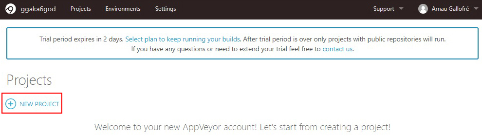
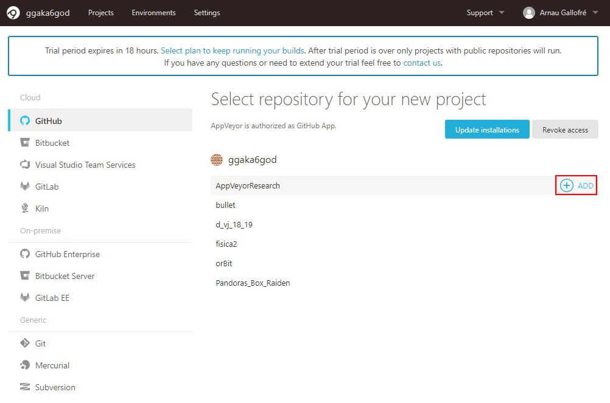
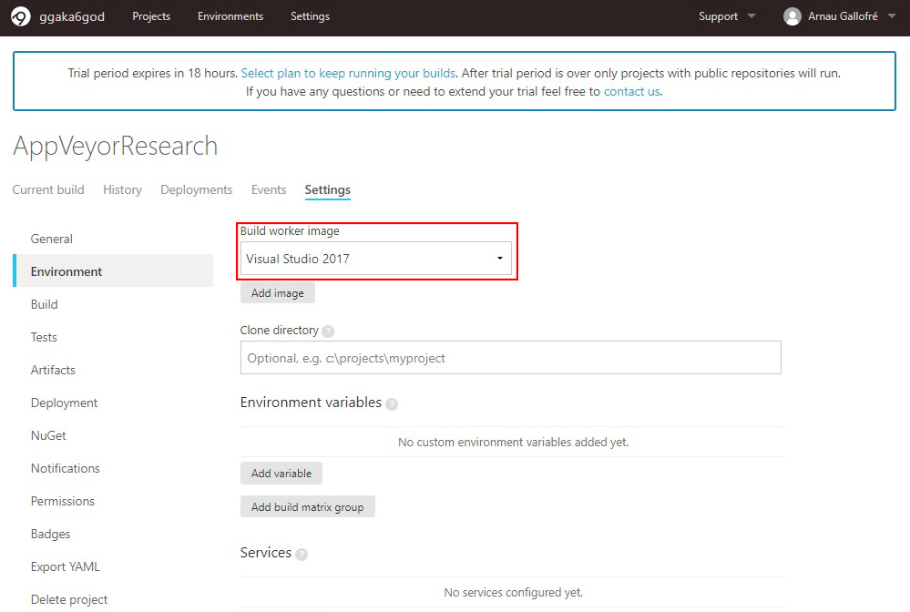
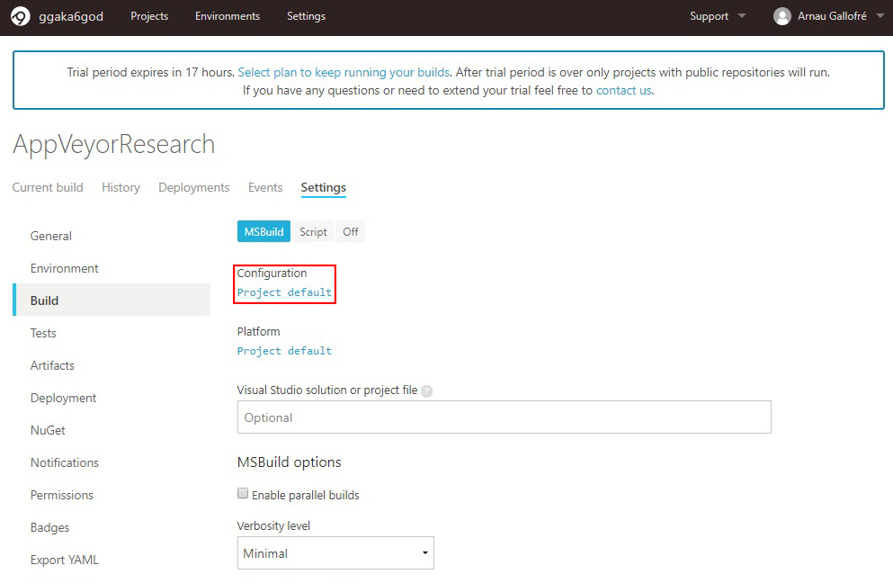
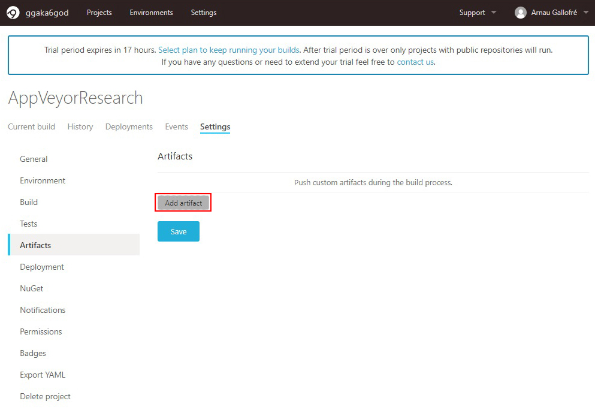
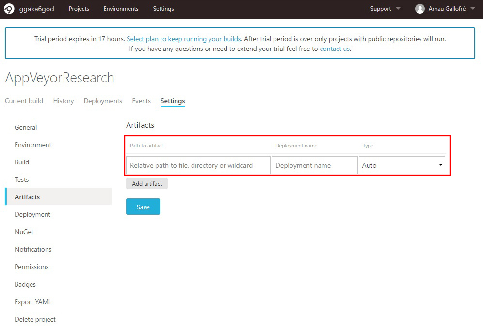
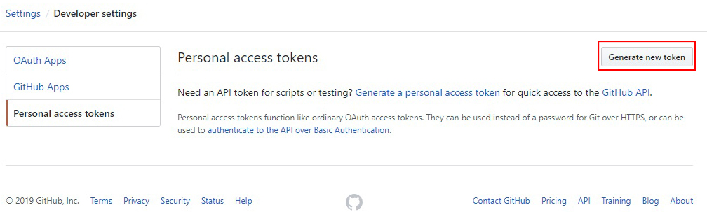
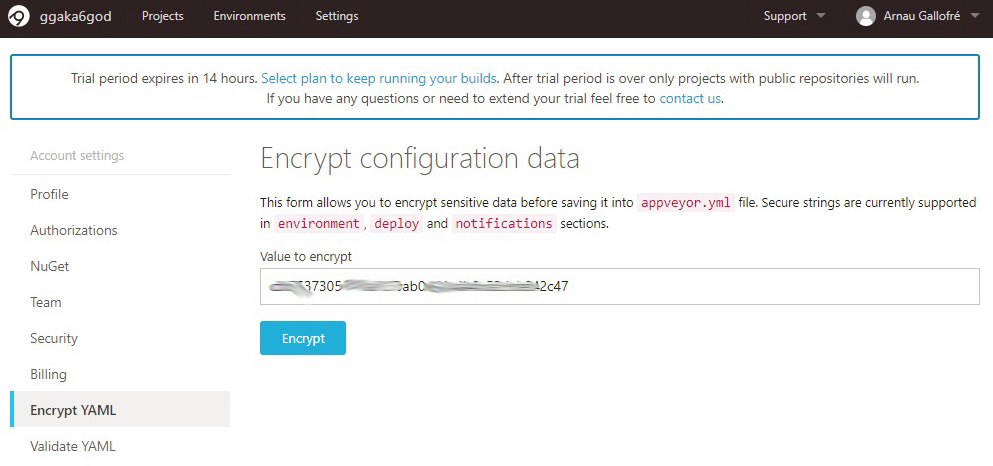
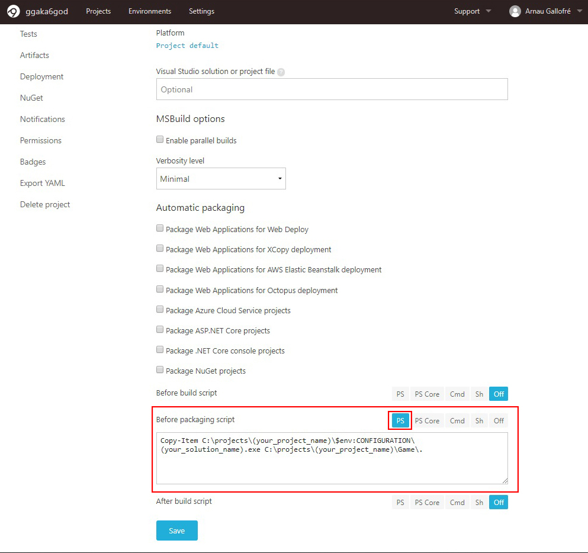

“I am [Arnau Gallofré](https://www.linkedin.com/in/arnau-gallofr%C3%A9-649785180/), student of the [Bachelor’s Degree in Video Games by UPC at CITM](https://www.citm.upc.edu/ing/estudis/graus-videojocs/). This content is generated for the second year’s subject Project 2, under supervision of lecturer [Ricard Pillosu](https://es.linkedin.com/in/ricardpillosu/).”

## About Appveyor

When you are developing a videogame in a team, you are constantly adding content to the project, and in order to test it quickly and saving a lot of time doing manually releases, on 12 November 2014 Microsoft created a powerful tool called AppVeyor, an online app that does the releases for you automatically. There are other apps that does the same, like Travis, but we will focus on AppVeyor.

So, if you want automatic builds for your project, follow the steps below:

## Sign-Up:

This part is quite easy if you already have an Github account. Remember to select the FREE plan account. Then, just use your Github username and password. [Sign-Up Here](https://ci.appveyor.com/signup).

Now that we have both accounts synchronized, we will need to create a new AppVeyor project selecting the repository we want to have. But if we do a commit, we will have errors and the build will fail. This is because the configuration of the project is wrong. But don't worry, we will fix it right now.

## Configuration:

The key of AppVeyor is the file that you create when you finish the configuration. This file is called **appveyor.yml** and is the file that AppVeyor will read every time you do a commit. You can fill this file manually (Bad idea), or export it from AppVeyor once you have all set up (Great idea). Once you have this file, you only have to put it in the main folder of your repository, with the README and the licenses.

Ok, this is the main page of our project. For now let's go to the settings tab.

Let's start with the General section. Here you can set up the build version and in which branch you want to make the build, even though there are another settings. **REMEMBER TO ALWAYS GO TO THE BOTTOM OF THE SECTION AND CLICK ON THE SAVE BUTTON. IF NOT, THE CHANGES WILL NOT APPLY**.

The next section is Environment, where you have to select the version of Visual Studio that you are using.

Let's continue with the Build section, where you will have to click on the "Project default" below Configuration. You will need to type Debug and Release, because you want AppVeyor to do it task for both configurations.

In the next section, Artifacts, you will need to add a new artifact, that is the file of the release. Is for what we are here now. So AppVeyor will ask you for 3 things: The path to the Game folder, the name of the artifact and the type. The first one is up to your project, so, write it down under your responsability. The name of the artifact can be whatever you want, the release zip file will have this name. On the type put "Web Deploy Package".

To have our release in our Github repository we will need to go to the Deployment section. First we need to change the deployment provider to Github Releases. Then I recommend to add a little description like "AutoRelease", and mark the "Draft Release" button. 

Last but not least, we need the Github authentication token, which we will find it in the Github settings (Not the repository settings, in our account settings, in Developer settings). 

Once we have our token ready, we need to encrypt it. You can do it [here](https://ci.appveyor.com/tools/encrypt).

Ok, now that we have the token on our project, AppVeyor can access to our repository. So let's begin with the last step. Now we need to move the executable that creates Visual Studio when you compile the code in the Release or Debug folder into the Game folder. We can achieve that by going to the Build section again. At the bottom, there's a option that says "Before packaging script", and by now is OFF. Let's put it in PS mode(PowerShell) and let's introduce the following line:

**Copy-Item C:\projects\(your-project-name)\$env:CONFIGURATION\(your-solution-name).exe C:\projects\(your-project-name)\Game\**.

With this, we have all set up to have automated builds in our project. 

But if you remember, there's a file called appveyor.yml that we had to put in our repository. It's very easy. We only have to go to the Export YAML section and click on "Download appveyor.yml". Put this file in your repo and that's all. The best part of these is that you can edit the configuration from the yml file directly like if it was an xml.

In addition, we have the Notification section, where you can select the channel you want to recieve when a build is done and if it's correct or not.

